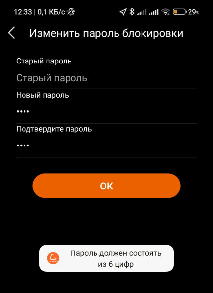
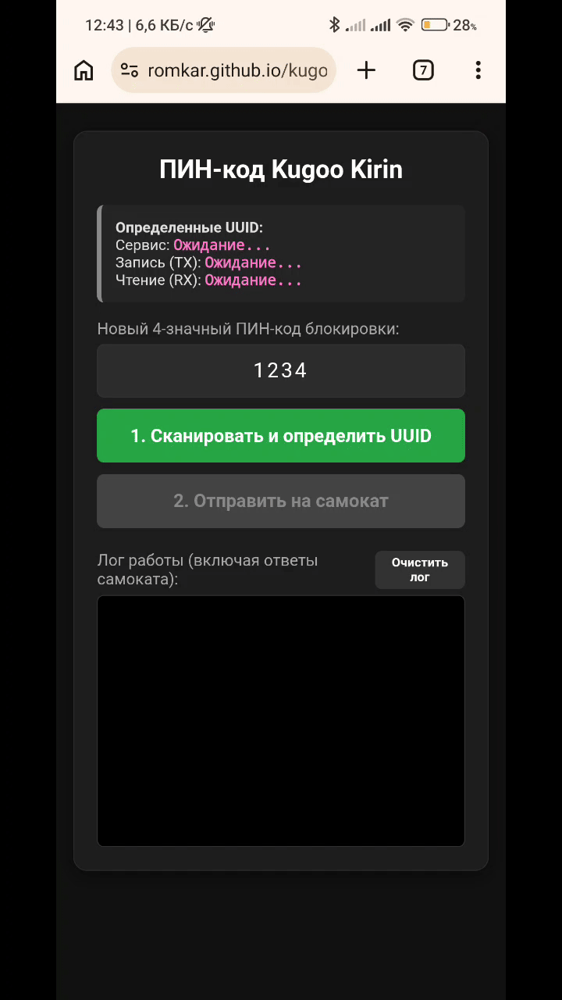

# Утилита для смены ПИН-кода самокатов Kugoo Kirin
 
## данная утилита [romkar.github.io/kugoo](https://romkar.github.io/kugoo/) предназначена для смены только 4-х значного ПИН-кода блокировки самоката через bluetooth

Протестированна и работает для Kugoo R1 на телефоне Android с браузером Google Chrome, вероятно будет работать и с другими самокатами Kugoo.

Причина создания этой программы в том, что стандартное приложение для Android Kugoo при попытке сменить пин-код выдает ошибку:

---
> [!IMPORTANT]
> Внимание! Не забудьте поменять пароль подключения к самокату по bluetooth (обычно 000000 или 123456), если этого не сделать, то злоумышленник сможет при помощи этой программы сменить ПИН-код блокировки самоката.
---

